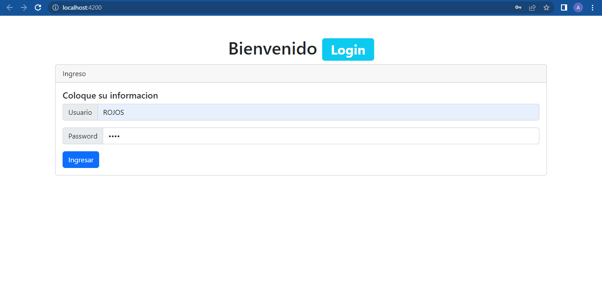

# PROYECTO_2
## TABLA DE DATOS

| CARNET | NOMBRE | NOMBRE AUX|
|:------:|:------:|:---------:|
|202003485   | AUGUSTO SEBASTIÁN ALVARADO LETONA  | JAVIER OSWALDO MIRÓN CIFUENTES     


## FRONTEND
En el frontend se trabajó toda la parte visual del proyecto, utilizando distintas tecnologías y servicios.



### ANGULAR:
Es un framework para aplicaciones web desarrollado en TypeScript, que se utiliza para crear y mantener aplicaciones web de una sola página.

### BOOTSTRAP:
Es un componente de función en el módulo core ng que se usa para iniciar la aplicación Angular manualmente, lo que le brinda más control sobre cómo inicializa su aplicación.
Se utilizó para obtener diseños predeterminados para la parte visual.

### HTML:
Evidentemente se utilizó para la creación del diseño de la página web.

EJEMPLO DE CODIGO DONDE SE USO HTML:
```
<!DOCTYPE html>
<html lang="en">

<head>
    <meta charset="UTF-8">
    <meta http-equiv="X-UA-Compatible" content="IE=edge">
    <meta name="viewport" content="width=device-width, initial-scale=1.0">
    
</head>

<body>

    <app-navigation></app-navigation>
    <a (click)="Volver()" class="btn btn-primary">Volver</a>
    <h1>Usuario Loggeado: <span class="badge bg-primary">{{usuario.Usuario}}</span></h1>

    <div class="container">
        <div class="row">
            <div class="mt-4 col-sm-3" *ngFor="let dato of datosJugadores">
                <app-tarjetas [datoJugadorEspecifico]="dato"></app-tarjetas>
            </div>
        </div>
    </div>

</body>

</html>
```


## BACKEND


### TYPESCRIPT:
TypeScript es un superconjunto de JavaScript con tipo que se compila para JavaScript puro.

En este proycto se utilizó para poder generar nuestro código desde cero y así crear nuestro Backend.

### JAVASCRIPT
Es un lenguaje de programación que los desarrolladores utilizan para hacer páginas web interactivas.

Tras crear el código con TypeScript, se hizo una transpilación con JavaScript dando así nuestro código fuente que hace funcionar todo el proyecto.

EJEMPLO DE CÓDIGO DONDE SE USO TYPESCRIPT:

```
import { Router } from "express";


class IndexRouter{

    public router: Router = Router();

    constructor(){
        this.config();
    }

    config(): void{
        this.router.get('/hola', (req, res) => res.send("Hola Mundo"));
    }
}

const indexRouter = new IndexRouter();
export default indexRouter.router;
```

EJEMPLO DE CÓDIGO DONDE SE TRANSPILÓ A JAVASCRIPT:

```
"use strict";
Object.defineProperty(exports, "__esModule", { value: true });
const express_1 = require("express");
class IndexRouter {
    constructor() {
        this.router = (0, express_1.Router)();
        this.config();
    }
    config() {
        this.router.get('/hola', (req, res) => res.send("Hola Mundo"));
    }
}
const indexRouter = new IndexRouter();
exports.default = indexRouter.router;

```# IPC12S2022-Proyecto2_202003485

